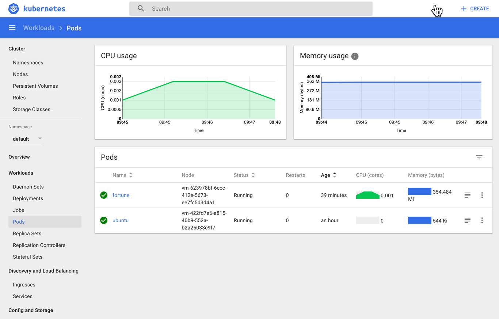
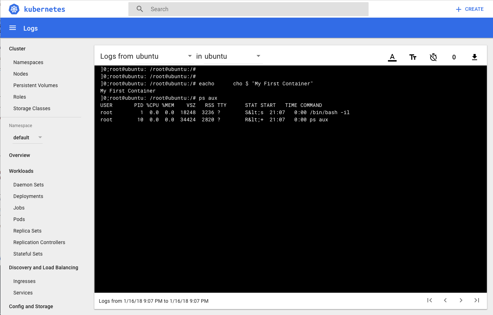

# Deploying Your First Container
In order to deploy our first container we must use a Pod. A Pod is a Kubernetes abstraction that represents a group of one or more application containers (such as Docker or rkt), and some shared resources for those containers.

## Deploy your first pod
Lets create our very first container application in the cluster. To do this we'll use the kubectl run command to create a single pod:

. Lets create our very first container application in the cluster. To do this we'll use the kubectl run command to create a single pod:
[source,bash]
---------------------------------------------------------------------
 $ kubectl run -i --tty ubuntu --image=ubuntu:16.04 --restart=Never -- /bin/bash -il
 If you don't see a command prompt, try pressing enter.
 root@ubuntu:/#
---------------------------------------------------------------------

[start=2]
. We've obtained an interactive shell into our container. Feel free to poke around this Ubuntu container. You can see it is started with minimal process by retrieving a process list:
[source,bash]
---------------------------------------------------------------------
 root@ubuntu:/# echo "My First Container"
 My First Container
 root@ubuntu:/# ps aux
 USER       PID %CPU %MEM    VSZ   RSS TTY      STAT START   TIME COMMAND
 root         1  0.0  0.0  18248  3236 ?        S<s  21:07   0:00 /bin/bash -il
 root        10  0.0  0.0  34424  2820 ?        R<+  21:07   0:00 ps aux
---------------------------------------------------------------------
[start=3]
. You can also view details about the running pod by selecting the Pods link on the lefthand menu within the dashboard application. Additionally, try clicking the pod you created (named 'Ubuntu') in the dashboard. Click the Logs icon near the top right of the screen. What do you see? It appears to be an identical log output to what you have in your terminal window!
+

. Lastly, you can use the kubectl CLI to retrieve details about the running pod. Open a new command window and use the get and details commands to view varying levels of details about your deployed pod: $ kubectl get pod ubuntu -o wide NAME READY STATUS RESTARTS AGE IP NODE ubuntu 1/1 Running 0 9m 10.200.24.3 vm-623978bf-6ccc-412e-5673-ee7fc5d3d4a1
[source,bash]
---------------------------------------------------------------------
 $ kubectl describe pod ubuntu
 Name:         ubuntu
 Namespace:    default
 Node:         vm-623978bf-6ccc-412e-5673-ee7fc5d3d4a1/10.0.16.11
 Start Time:   Tue, 16 Dec 2018 16:07:06 -0500
 Labels:       run=ubuntu
 Annotations:  <none>
 Status:       Running
 IP:           10.200.24.3
 Containers:
   ubuntu:
     Container ID:  docker://b9919fa275d6250a484e6ef68a66e82ef2c3070fc9475216a8e87f1bd8c73a44
     Image:         ubuntu:16.04
     Image ID:      docker-pullable://ubuntu@sha256:d3fdf5b1f8e8a155c17d5786280af1f5a04c10e95145a515279cf17abdf0191f
     Port:          <none>
     Args:
       /bin/bash
       -il
     State:          Running
       Started:      Tue, 16 Dec 2018 16:07:15 -0500
     Ready:          True
     Restart Count:  0
     Environment:    <none>
     Mounts:
       /var/run/secrets/kubernetes.io/serviceaccount from default-token-rwdps (ro)
 Conditions:
   Type           Status
   Initialized    True
   Ready          True
   PodScheduled   True
 Volumes:
   default-token-rwdps:
     Type:        Secret (a volume populated by a Secret)
     SecretName:  default-token-rwdps
     Optional:    false
 QoS Class:       BestEffort
 Node-Selectors:  <none>
 Tolerations:     <none>
 Events:
   Type    Reason                 Age   From                                              Message
   ----    ------                 ----  ----                                              -------
   Normal  Scheduled              10m   default-scheduler                                 Successfully assigned ubuntu to vm-623978bf-6ccc-412e-5673-ee7fc5d3d4a1
   Normal  SuccessfulMountVolume  10m   kubelet, vm-623978bf-6ccc-412e-5673-ee7fc5d3d4a1  MountVolume.SetUp succeeded for volume "default-token-rwdps"
   Normal  Pulling                10m   kubelet, vm-623978bf-6ccc-412e-5673-ee7fc5d3d4a1  pulling image "ubuntu:16.04"
   Normal  Pulled                 10m   kubelet, vm-623978bf-6ccc-412e-5673-ee7fc5d3d4a1  Successfully pulled image "ubuntu:16.04"
   Normal  Created                10m   kubelet, vm-623978bf-6ccc-412e-5673-ee7fc5d3d4a1  Created container
   Normal  Started                10m   kubelet, vm-623978bf-6ccc-412e-5673-ee7fc5d3d4a1  Started container
---------------------------------------------------------------------

