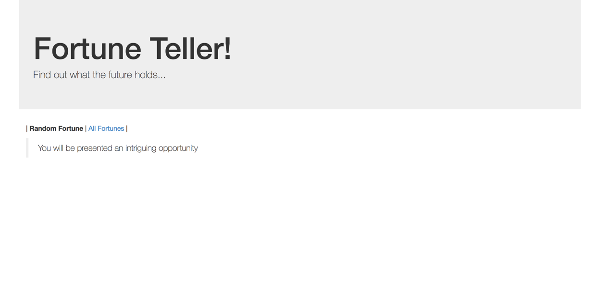

= Kubernetes Declarative Configuration

Lets deploy the initial version of our demo application, PKS Fortune Teller.  This is a 3 tier application that contains a HTML/JavaScript app served from Nginx, a Spring Boot REST backend, and a Redis persistent data service.

image::img/fortune_arch.png[]

== Create declarative resource definition for demo application
. Create an empty *.yml* file named demo-pod.yml.  We will use this file to create the declarative configuration of the API objects required to deploy the demo application in a single pod.
. Add the resource declaration to the yml file for a Pod API abject as follows:
+
[source,yml]
---------------------------------------------------------------------
apiVersion: v1
kind: Pod
metadata:
  name: fortune
---------------------------------------------------------------------

. Next, on the line beneath the _metadata_ definition add the spec for the 3 containers within our application.  The _containers_ is an array.  Each container should define the image, a name for the container within the pod, and a list of ports to be exposed from the container
+
[source,yml]
---------------------------------------------------------------------
spec:
  containers:
  - image: azwickey/fortune-ui:latest
    name: fortune-ui
    ports:
    - containerPort: 80
      protocol: TCP
  - image: azwickey/fortune-backend-jee:latest
    name: fortune-backend
    ports:
    - containerPort: 9080
      protocol: TCP
  - image: redis
    name: redis
    ports:
    - containerPort: 6379
      protocol: TCP
---------------------------------------------------------------------

. Lastly, add a labels attribute to the metadata section of the resource configuration.  We'll add an "app" and "deployment" label.  Make sure this is a child of the metadata attribute
+
[source,yml]
---------------------------------------------------------------------
labels:
  app: fortune
  deployment: pks-workshop
---------------------------------------------------------------------

. The completed pod declaration should look like this:
+
[source,yml]
---------------------------------------------------------------------
apiVersion: v1
kind: Pod
metadata:
  labels:
    app: fortune
    deployment: pks-workshop
  name: fortune
spec:
  containers:
  - image: azwickey/fortune-ui:latest
    name: fortune-ui
    ports:
    - containerPort: 80
      protocol: TCP
  - image: azwickey/fortune-backend-jee:latest
    name: fortune-backend
    ports:
    - containerPort: 9080
      protocol: TCP
  - image: redis
    name: redis
    ports:
    - containerPort: 6379
      protocol: TCP
---------------------------------------------------------------------

== Create a service resource for routing traffic
. Within the same yml file, create another yml directive at the top of the file.  Yml directives are separated by 3 dashes ('---').  Within this new directive add the resource definition for a Service API object as follows:
+
[source,yml]
---------------------------------------------------------------------
apiVersion: v1
kind: Service
metadata:
  name: fortune-service
---
---------------------------------------------------------------------

. Next, on the line beneath the _metadata_ definition add the spec for the ports that need to exposed by our application.  The _ports_ attribute is an array.  Additionally, the service spec requires a service _type_.  We'll use the type *LoadBalancer* since we want to expose our application externally
+
[source,yml]
---------------------------------------------------------------------
spec:
  ports:
  - port: 80
    name: ui
  - port: 9080
    name: backend
  - port: 6379
    name: redis
  type: LoadBalancer
---------------------------------------------------------------------
. We must create resource selector in order to determine which pods to link to the service.  This is where the label we applied to the pod resource object comes into play.  We'll create a selector to select and pod that has the label *app: fortune*.  Add this selector as the last attribute of the Service _spec_, right under the type attribute.
+
[source,yml]
---------------------------------------------------------------------
selector:
  app: fortune
---------------------------------------------------------------------
. As with the pod API object, add a _labels_ attribute to the metadata section of the service resource configuration.  We'll add the same labels "app" and "deployment", but use a different value for the app label to differentiate our pod and our service.
+
[source,yml]
---------------------------------------------------------------------
labels:
  app: fortune-service
  deployment: pks-workshop
---------------------------------------------------------------------

. The completed configuration for the Pod and Service API objects should appear as follows:
+
[source,yml]
---------------------------------------------------------------------
apiVersion: v1
kind: Service
metadata:
  labels:
    app: fortune-service
    deployment: pks-workshop
  name: fortune-service
spec:
  ports:
  - port: 80
    name: ui
  - port: 9080
    name: backend
  - port: 6379
    name: redis
  type: LoadBalancer
  selector:
    app: fortune
---
apiVersion: v1
kind: Pod
metadata:
  labels:
    app: fortune
    deployment: pks-workshop
  name: fortune
spec:
  containers:
  - image: azwickey/fortune-ui:latest
    name: fortune-ui
    ports:
    - containerPort: 80
      protocol: TCP
  - image: azwickey/fortune-backend-jee:latest
    name: fortune-backend
    ports:
    - containerPort: 9080
      protocol: TCP
  - image: redis
    name: redis
    ports:
    - containerPort: 6379
      protocol: TCP
---------------------------------------------------------------------

== Deploy the demo application
. Open a command window and *watch* the kubectl _get_ command.  Use the labels we attached to the resources earlier as filters so only the resources associated with the demo application appear.  Initially no resources will be found.
+
[source,bash]
---------------------------------------------------------------------
 watch kubectl get all -l deployment=pks-workshop --show-labels
---------------------------------------------------------------------

. Deploy the demo application to your Kubernetes cluster using the kubectl _create_ command, using the declarative configuration you just created
+
[source,bash]
---------------------------------------------------------------------
$ kubectl create -f demo-pod.yml
service "fortune-service" created
pod "fortune" created
---------------------------------------------------------------------

. Inspect the output of your watch of the kubectl get command.  You'll see the newly deployed Pod and Service appear and startup.  Take note of the external IP address that is assigned to the fortune-service as that can be used to access the application in the next step.
+
[source,bash]
---------------------------------------------------------------------
Every 2.0s: kubectl get all -l deployment=pks-workshop --show-labels                                                                               Wed Jan 17 09:11:31 2018

NAME         READY     STATUS    RESTARTS   AGE       LABELS
po/fortune   3/3       Running   0          2m        app=fortune,deployment=pks-workshop

NAME                  TYPE           CLUSTER-IP       EXTERNAL-IP    PORT(S)                                      AGE       LABELS
svc/fortune-service   LoadBalancer   10.100.200.249   35.229.79.31   80:30828/TCP,9080:30049/TCP,6379:31123/TCP   2m        app=fortune-service,deployment=pks-workshop

---------------------------------------------------------------------

. Open a web browser and access the application using the external IP on port 80.  E.G. http://35.229.79.31
+
image::images/02-3.png[]

. Right now we receive the default fortune of "Your future is murky" because the Redis backend doesn't have any fortunes loaded.  Click on the _All Fortunes_ link and type a fortune in the text box.  Upon hitting return the fortune will be stored into Redis.  Add multiple fortunes.
+
image::images/02-4.png[]

. Additionally, you may recall we exposed a service on port 9080.  This represents the backend Java JEE application exposing a JAX-RS service endpoint.  Access the /fortune-backend-jee/app/fortune/all endpoint using the external IP address but specify port 9080 this time.  E.G. http://35.229.79.31:9080/fortune-backend-jee/app/fortune/all  This can be done in a web browser or using a tool such as Curl:
+
[source,bash]
---------------------------------------------------------------------
$ curl -v http://35.229.79.31:9080/fortune-backend-jee/app/fortune/all
*   Trying 35.229.79.31...
* TCP_NODELAY set
* Connected to 35.229.79.31 (35.229.79.31) port 8080 (#0)
> GET /fortune-backend-jee/app/fortune/all HTTP/1.1
> Host: 35.229.79.31:9080
> User-Agent: curl/7.54.0
> Accept: */*
>
< HTTP/1.1 200
< X-Application-Context: application
< Content-Type: application/json;charset=UTF-8
< Transfer-Encoding: chunked
< Date: Wed, 17 Jan 2018 14:22:56 GMT
<
* Connection #0 to host 35.229.79.31 left intact

[{"id":-4444707096755004792,"text":"Life is like a box of chocolates"},{"id":2430761989352307888,"text":"You will be presented an intriguing opportunity"},{"id":4567102070760611966,"text":"YOLO, go for it!"}]%
---------------------------------------------------------------------
. Lastly, if the Redis Client CLI is installed on your machine attempt to access Redis using the service port exposed for Redis: 6379
+
[source,bash]
---------------------------------------------------------------------
$ redis-cli -h 35.229.79.31
35.229.79.31:6379> ping
PONG
---------------------------------------------------------------------