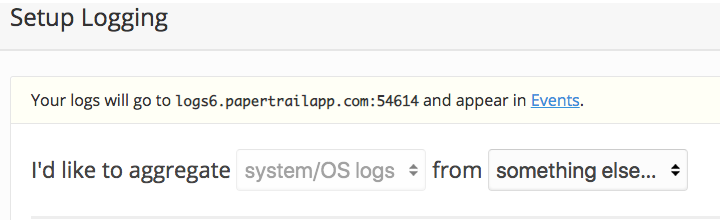
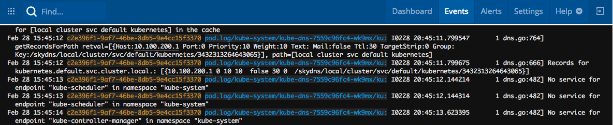

= Monitoring and Logging

Application operators are often interested in long-term retention, indexing, and analysis of logs.

In this section, we'll drain logs to a very simple provider called https://papertrailapp.com[Papertrail].

. Visit https://papertrailapp.com and create a free account.

. Login to your account and add your first system:
+
image::img/papertrail_1.png[]

. Click on `Add your first system`:
+

. We'll use sink resources to configure destinations for logs transported following the Syslog Protocol. We can create sink resource configuration for clusters (eg: link:lab_k8s/cluster_sink.yml[cluster sink sample]) or for namespaces (eg: link:lab_k8s/sink.yml[sink sample]).

. Apply the resources to your cluster
+
----
$ kubectl apply -f cluster_sink.yml
clustersink.apps.pivotal.io/demo-cluster-sink created

$ kubectl apply -f sink.yml
sink.apps.pivotal.io/demo-default-sink created
----

. Go back to papertrail site and check the Events page. We should be able to see logs being streamed in.
+

All sink log entries use the following format:

`APP-NAME/NAMESPACE/POD-ID/CONTAINER-NAME`

 * Pod logs entries are distinguished by the string `pod.log` in the APP-NAME field
 * Kubernetes API Event entries are distinguished by the string `k8s.event` in the APP-NAME field.
